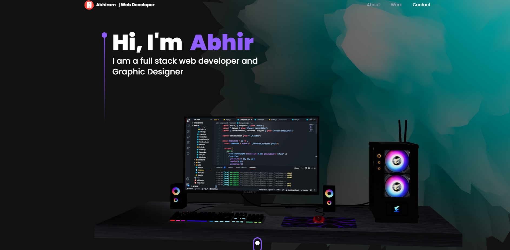

# My Three.js Portfolio Website

## Overview

Welcome to my portfolio website! This site showcases my projects and skills using the powerful Three.js library to create immersive 3D web experiences. Here, you will find interactive 3D models, animations, and other demonstrations of my work. This README provides an overview of the website's structure, setup instructions, and other essential information.

## Table of Contents

1. [Features](#features)
2. [Installation](#installation)
3. [Usage](#usage)
4. [Project Structure](#project-structure)
5. [Technologies Used](#technologies-used)
6. [Contributing](#contributing)
7. [License](#license)
8. [Contact](#contact)

## Features

- **Interactive 3D Models**: Explore various 3D models that demonstrate my skills in Three.js and 3D graphics.
- **Animations**: Experience smooth and dynamic animations implemented with Three.js.
- **Responsive Design**: The website is fully responsive and works well on different devices and screen sizes.
- **Project Showcase**: Detailed pages for each project with descriptions, screenshots, and live demos.
- **Contact Form**: Easily get in touch with me through the contact form.

## Installation

To set up the project locally, follow these steps:

1. **Clone the repository**:
   ```bash
   git clone https://github.com/Royal-Dragon/Portfolio_2.0.git
2. **Naavigate to Directory**:
   ```bash
   cd portfolioo
3. **install and Run the Program**:
   ```bash
   npm i
   npm run dev
## Screenshots
